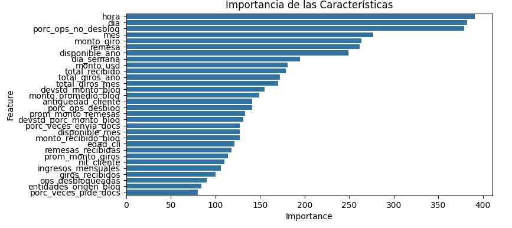

# Predictive Analytics for Customer Reactivation

### Project Overview

This project focuses on developing a machine learning model to identify inactive credit card customers who are most likely to resume their card usage. The goal is to enable a financial services "client" to run a targeted and efficient reactivation campaign by selectively unlocking credit card quotas for high-potential customers. This data-driven approach aims to maximize customer engagement and transaction revenue while minimizing the risks associated with a mass-unlocking strategy.

---

### Problem Statement

A financial services company is facing a challenge with a segment of customers whose credit card accounts have become inactive (i.e., their credit quota is locked). The company wants to re-engage these customers but recognizes that unlocking all accounts simultaneously is inefficient and could increase risk.

The key business question is: **"Can we accurately predict which customers will use their credit card within the next three months if their quota is unlocked?"**

This project addresses this by building a binary classification model that assigns a reactivation probability to each inactive customer.

---

### Data

The dataset used is a simulated collection of anonymized customer data, mirroring typical financial and demographic profiles. It contains **20,131 records** and **25 attributes**, including:

* **Demographic data:** `EDAD`, `GENERO`, `NIVEL_EDUCATIVO`.
* **Financial indicators:** `SALDO_DISPONIBLE_TC`, `SALDO_EN_MORA`, `USO_ULT_3M`.
* **Product ownership:** `TIENE_PRESTAMO_HIPOTECARIO`, `TIENE_PRESTAMO_CONSUMO`.
* **Target Variable:** `USO_TC_3M_DESPUES` (1 if the customer used the card, 0 otherwise).

---

### Methodology

The project followed a standard data science workflow:

1.  **Exploratory Data Analysis (EDA):** I analyzed variable distributions, correlations, and data quality to gain insights. Key findings include a strong correlation between available balance (`SALDO_DISPONIBLE_TC`) and recent usage (`USO_ULT_3M`) with the target variable.

2.  **Data Preprocessing:**
    * Categorical features were transformed using **One-Hot Encoding**.
    * Numerical features were scaled using **StandardScaler** to prepare them for modeling.

3.  **Modeling:**
    * A **Logistic Regression** model was trained as a baseline to establish an initial performance benchmark.
    * A **Gradient Boosting Classifier** was trained for its high predictive power and ability to handle complex relationships in the data.

4.  **Evaluation:** The models were evaluated based on the **Area Under the ROC Curve (AUC)**, as it provides a robust measure for imbalanced classification problems. The Gradient Boosting model emerged as the top performer.

---

### Results & Key Findings

* The final **Gradient Boosting model achieved an AUC score of 0.98** on the test set, and *F1 Score* of 0.88 demonstrating a strong ability to distinguish between customers who are likely to be reactivated and those who are not.
* The most influential features for the prediction were:
    1.  The feature "hora" (hour) has the highest importance, followed by "día" (day), "porc_ops_no_desbloq" (percent of operations not unlocked), and other features related to money             flow (such as "monto_giro" (amount sent), "remesas" (remittances), etc.).
    2.  Features related to transactions, amounts, and times (like "monto_usd" (USD amount), "total_recibido" (total received), etc.) seem to be more significant compared to those                related to "entidades_origen_blog" (source entities) or "porc_veces_pue_docs" (percent of times docs could be sent), which appear to have much lower importance.



---

### Business Impact & Recommendations

The developed model provides actionable intelligence for the "client's" marketing and risk departments.

* **Recommendation:** Implement a targeted reactivation campaign focusing on the **top 20% of customers** ranked by the model's prediction probability.
* **Expected Outcome:** This data-driven strategy is projected to significantly improve the campaign's return on investment (ROI) by concentrating resources on customers with the highest potential for re-engagement.
* **Next Steps:** The model could be further improved by incorporating transactional data or customer behavior metrics for even greater accuracy.

---

### Technologies Used

* **Python:** 3.9.0
* **Data Analysis & Manipulation:** Pandas, NumPy
* **Machine Learning:** Scikit-learn
* **Data Visualization:** Matplotlib, Seaborn

---

### How to Run

1.  Clone the repository:
    ```bash
    git clone https://github.com/JuanesAF/customer-reactivation-model.git

    ```
2.  Navigate to the project directory:
     ```bash
    cd customer-reactivation-model
    ```
3.  Install the required libraries (opcional, si creas un `requirements.txt`):
    ```bash
    pip install -r requirements.txt
    ```
4.  Navigate to the `notebooks` directory and open `01_model_development.ipynb` using Jupyter Notebook or JupyterLab.
